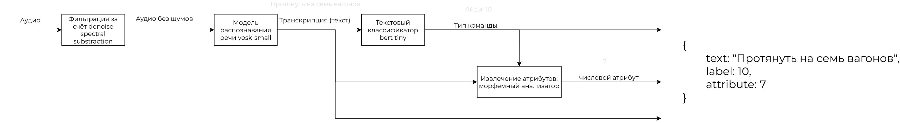

### Описание датасета
Дан датасет, состоящий из аудиозаписей, в каждой из которых произносится одна команда из заранее известного списка. 
Требуется определить код произнесённой команды и извлечь из неё атрибуты, если таковые имеются. 

Распознание команд может быть затруднено из-за высокого уровня шума. Система должна занимать меньше 1 ГБ ОЗУ, обрабатывать аудио меньше, чем за 500 мс.
### Описание решения
Разработанная архитектура имеет следующий вид: 

Для лучшего распознания в грамматику vosk-small-ru были добавлены фразы из списка команд и числительные. Модель rubert-tiny2 была обучена с добавлением ещё одного класса команд, подразумевающего, что аудиозапись нельзя отнести ни к одному из определённых типов команд.
### Файловая структура
```bash
.
├── get_submission.py - Пайплайн обработки аудиозаписей
├── model.py - Логика работы моделей
├── weights - Веса моделей
│   ├── rubert_tiny_noised - Текстовый классификатор
│   └── vosk-model-small-ru-0.22 - Аудио2текст
├── train_pipeline - обучение
│   ├── architecture.jpg
│   ├── Обучение_BERT_классификатора.ipynb
│   └── label2id.py - Соответствие классов и команд
├── test_audio - Примеры аудиозаписей
├── readme.md
├── requirements.txt
```